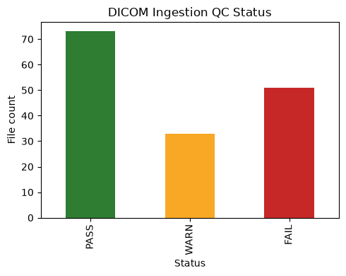
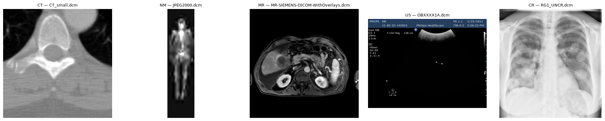
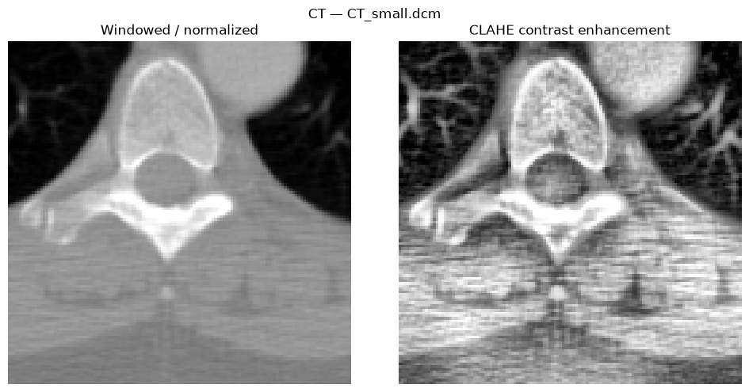
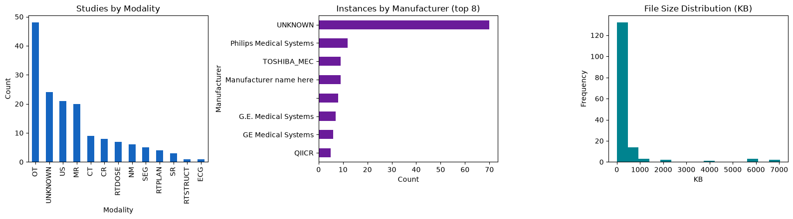

# DICOM Data Analysis Pipeline

[](https://colab.research.google.com/github/anmolwd1/dicom-analysis-pipeline/blob/main/dicom_pipeline_showcase.ipynb)
[](LICENSE)
[](requirements.txt)

An end-to-end DICOM data-handling pipeline covering the stages a hospital or imaging-centre: **ingestion → metadata inventory → data-quality/conformance validation → de-identification (PHI handling) → pixel-data visualization → basic image processing → aggregate analytics → export/reporting.**

Built as a portfolio piece to demonstrate practical DICOM engineering.

> **No real patient data is used anywhere in this project.** The notebook runs entirely on the small, public, synthetic DICOM sample files bundled with the [`pydicom`](https://pydicom.org/) library (CT, MR, US, CR, NM, structured reports, RT objects, etc.), so it executes standalone with no downloads, credentials, or PHI exposure. The same code paths work unmodified against a real PACS export or a DICOMweb (QIDO-RS/WADO-RS) pull - see [Production Considerations](#production-considerations) below.

This project ships two ways to run the same pipeline logic:

- **The notebook** (`dicom_pipeline_showcase.ipynb`) — a self-contained, visual walkthrough. Best for a quick demo.
- **The `dicom_pipeline` package** (`src/dicom_pipeline/`) — the same stages as installable, tested Python modules with a CLI. Best for reuse, automation, or as a starting point for a real integration.

## Quick start — notebook

Click **Open in Colab** above and run all cells - no setup required, ~1-2 minutes end-to-end.

To run locally:

```bash
git clone https://github.com/anmolwd1/dicom-analysis-pipeline.git
cd dicom-analysis-pipeline
pip install -r requirements.txt
jupyter notebook dicom_pipeline_showcase.ipynb
```

## Quick start — package & CLI

```bash
git clone https://github.com/anmolwd1/dicom-analysis-pipeline.git
cd dicom-analysis-pipeline
pip install -e ".[dev]"

# Zero-setup demo, using the same public pydicom sample files as the notebook:
dicom-pipeline run --sample --output ./output

# Or point it at a real folder of .dcm files:
dicom-pipeline run --input /path/to/dicom/folder --output ./output
```

This writes `dicom_inventory.csv`, `dicom_qc_report.csv`, `pipeline_summary_report.json`, and a `deidentified/` folder into `--output`.

Run the test suite with:

```bash
pytest
```

## What it demonstrates

| Stage | What happens |
|---|---|
| **1. Ingestion** | Simulates files landing from a PACS/DICOMweb export; parses headers safely even when malformed |
| **2. Metadata inventory** | Structured pandas DataFrame of patient/study/series/modality/geometry tags |
| **3. Data quality & conformance QC** | Flags missing required tags, unsupported transfer syntaxes, corrupt pixel data — PASS/WARN/FAIL per instance |
| **4. De-identification** | PS3.15-inspired PHI scrubbing: pseudonymized `PatientID`, blanked names/institution/physicians, private-tag stripping, `PatientIdentityRemoved` flag |
| **5. Pixel visualization** | CT/MR windowing via rescale slope/intercept + `WindowCenter`/`WindowWidth`; correct handling of color (RGB/YBR/PALETTE) and inverted (`MONOCHROME1`) images |
| **6. Image processing** | Min-max normalization and CLAHE contrast enhancement |
| **7. Analytics dashboard** | Modality mix, equipment/vendor mix, file-size distribution |
| **8. Export** | CSV inventory, QC report, JSON summary, zipped de-identified dataset |

On the bundled sample set (157 files, 12 modalities, 25 synthetic patients, 37 studies), the pipeline runs in full and produces:

## Sample output

**Metadata QC across the ingested batch** — genuine failures (missing required tags, undecoded transfer syntaxes) are separated from benign non-issues (e.g. a structured report having no pixel data):



**Windowed pixel data across modalities** — correct grayscale windowing, color-space handling, and `MONOCHROME1` inversion:



**CLAHE contrast enhancement**, one step in the pre-processing chain a downstream viewer, QA tool, or ML model would use:



**Aggregate analytics** — modality mix, top equipment vendors, file-size distribution:



## Repository structure

```
.
├── dicom_pipeline_showcase.ipynb   # self-contained visual demo (runs standalone in Colab)
├── src/dicom_pipeline/              # installable package -- the same stages as tested modules
│   ├── ingest.py                    # safe file discovery & parsing
│   ├── inventory.py                 # metadata DataFrame
│   ├── qc.py                        # conformance rules engine
│   ├── deidentify.py                # PHI scrubbing
│   ├── processing.py                # windowing, color handling, CLAHE
│   ├── analytics.py                 # summary statistics
│   └── cli.py                       # `dicom-pipeline run ...`
├── tests/                           # pytest suite, run against pydicom's public sample data
├── images/                          # README screenshots, generated by the notebook
├── pyproject.toml                   # package metadata, CLI entry point, pytest config
├── requirements.txt                 # pinned versions for the notebook
└── LICENSE
```

The notebook and the package implement the same logic independently — the notebook stays fully self-contained so it runs in Colab with a single `pip install`, while the package is the version meant for reuse, automation, or extension.

## Privacy & compliance note

The de-identification routine in Section 5 is a **demonstration**, not a certified tool. It follows the spirit of the DICOM PS3.15 Basic Application Level Confidentiality Profile (blank/pseudonymize direct identifiers, strip private tags, flag `PatientIdentityRemoved`), but a production deployment should use a validated product — RSNA CTP, Orthanc's anonymization plugin, or the `dicom-anonymizer` library — with its tag list reviewed against the institution's own PHI policy and HIPAA Safe Harbor / Expert Determination requirements.

## Production considerations

Talking points for how this maps onto a real imaging-centre deployment:

- **Ingestion at scale** - a DICOM C-STORE SCP (`pynetdicom`) or DICOMweb STOW-RS receiver, processed asynchronously via a queue rather than in-process.
- **PACS/VNA integration** - query via QIDO-RS/C-FIND, retrieve via WADO-RS/C-MOVE; [Orthanc](https://www.orthanc-server.com/) is a good open-source reference PACS to build and test against.
- **De-identification compliance** - swap in a validated tool, get the tag list reviewed by compliance/legal, and audit-log every de-identification event.
- **Data quality at scale** - run the QC engine as a pre-commit gate before archiving; route FAIL status to a quarantine queue with alerting instead of dropping files silently.
- **Storage & security** - encrypt at rest and in transit, apply role-based access control, and keep de-identified research copies separated from the clinical PACS.
- **Throughput** - parallelize metadata extraction and pixel decoding (multiprocessing, Spark/Dask) once volumes exceed a single machine.
- **Observability** - feed the aggregate analytics into a persistent dashboard (Grafana/Metabase) rather than regenerating plots ad hoc.
- **Downstream ML** - the normalized/windowed arrays are the same pre-processing a triage or CAD model would expect as input.

## Tech stack

[`pydicom`](https://pydicom.org/) · [`pandas`](https://pandas.pydata.org/) · [`numpy`](https://numpy.org/) · [`matplotlib`](https://matplotlib.org/) · [`scikit-image`](https://scikit-image.org/) · [`pytest`](https://pytest.org/)

## License

MIT — see [LICENSE](LICENSE).

## Author

Anmol Wadhwa
